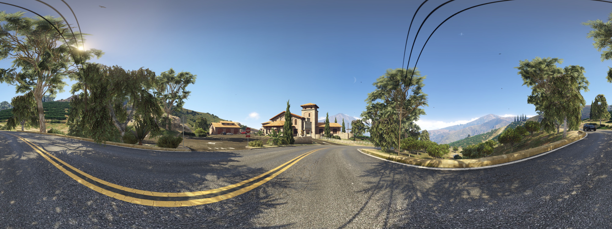

# Synthetic Data Generation for Visual Geo-Localization using GTA V



This repository contains the data generation pipeline to generate a visual geo-localization dataset from the video game Grand Theft Auto V (GTA V) proposed by *Skutsch et al.* in their paper **Synthetic Data Generation for Visual Geo-Localization using GTA V**. It can be used to generate ground-view images and panoramas, drone-view images, and satellite-view images and extract their corresponding stencil and depth map. For each image, the corresponding metadata is exported. This includes the intrinsic and extrinsic camera matrices, the camera's position and orientation within the game environment, the prevailing weather conditions, and the current time of the day.

The setup can be done either semi-automatically or completely manually. In the semi-automatic setup, most of the steps are performed by an initialization script, while in the manual setup, all steps are performed by the user. The data generation has been tested on a Windows 10 system running `Grand Theft Auto V Legacy v1.0.3586.0`, `ScriptHookV v3586.0 / 889.22`, `ScriptHookVDotNet v3.7.0-nightly.48`, `RenderDoc v1.40`, and `Windowed Borderless Gaming v2.1.0.1`. Steps may vary for other versions.


## Important Notes

- The global hook feature of RenderDoc is used to inject into the GTA V process. This feature requires Secure Boot to be disabled.
- Currently, the pipeline only works with the Legacy version of Grand Theft Auto V.
- If any of the directories accessed require administrator privileges, the scripts must be executed as administrator.
- The initialization script's automatic downloads may only work on private networks.
- After copying the save game to the profile folder, you may need to select it after the next startup. To use the copied save game, check the box labeled `Select all local data`, click `Review`, and then click `Confirm`.
- It may take a few days for ScriptHookV to be updated after a GTA V update.
- The resolution set in the Windowed Borderless Gaming's `config.ini` file is multiplied by the global scaling factor defined in the Windows settings. For example, if the global scaling factor is set to 125%, the resolution is multiplied by 1.25.


## Semi-Automatic Setup

### GTA V
1. Download and install the latest version of GTA V Legacy from [Steam](https://store.steampowered.com/), [Epic Games](https://store.epicgames.com/), or the [Rockstar Games website](https://www.rockstargames.com/).
2. Open the Rockstar Games Launcher, then go to Settings.
3. In `Settings/Launcher Settings/General` disable the option `BattleEye`.
4. In `Settings/My Installed Games/Grand Theft Auto V` disable the option `Enable Automatic Updates`.
5. In `Settings/My Installed Games/Grand Theft Auto V` add `-windowed -width 1280 -height 720` to `Launch Arguments`.
6. Start the game, then go to the settings menu.
7. In `Settings/Notifications` disable all notifications.
8. In `Settings/Saving and Startup` set the option `Landing Page` to `Off` and set the option `Startup Flow` to `Load into Story Mode`.
9. Adjust the graphics settings to the desired level of detail and resolution. Make sure `NVIDIA TXAA` is enabled.
10. If you experience random frame drops in the menu or map at any point, enable V-Sync.

### Python
1. Download and install Python from the [website](https://www.python.org/downloads/). A version newer than 3.12 may cause deprecation warnings and errors.
2. Download and install the required modules by running `pip install -r requirements.txt`. Note that the module `CuPy` can only be used if a CUDA-capable GPU is installed.

### Visual Studio
1. Download and install the latest version of Visual Studio from the [website](https://visualstudio.microsoft.com/).
2. Set it up for .NET and C++ Desktop development.
3. Add `MSBuild` to the Windows `PATH`. In Microsoft Visual Studio 2022, the files are usually located at `C:\Program Files\Microsoft Visual Studio\2022\Community\MSBuild\Current\Bin`.
4. Add `dumpbin` and `lib` to the Windows `PATH`. In Microsoft Visual Studio 2022, the files are usually located at `C:\Program Files\Microsoft Visual Studio\2022\Community\VC\Tools\MSVC\14.44.35207\bin\Hostx64\x64\`. Note that the versions in the path need to be adjusted accordingly.

### Further Initialization
1. Download and install the modifications by running the initialization script `initialize_project.py` with the following arguments:
   - `--gta_ins_dir`/`-g` Installation directory of GTA V (usually `C:\Program Files\Rockstar Games\Grand Theft Auto V Legacy`) 
   - `--gta_usr_dir`/`-u` User directory of GTA V (usually `C:\USER\Documents\Rockstar Games\GTA V`)
   - `--vs_dir`/`-v` Installation directory of Visual Studio (usually `C:\Program Files\Microsoft Visual Studio\2022\Community`)


## Manual Setup

### GTA V
1. Download and install the latest version of GTA V Legacy from [Steam](https://store.steampowered.com/), [Epic Games](https://store.epicgames.com/), or the [website of Rockstar Games](https://www.rockstargames.com/).
2. Open the Rockstar Games Launcher, then go to Settings.
3. In `Settings/Launcher Settings/General` disable the option `BattleEye`.
4. In `Settings/My Installed Games/Grand Theft Auto V` disable the option `Enable Automatic Updates`.
5. In `Settings/My Installed Games/Grand Theft Auto V` add `-windowed -width 1280 -height 720` to `Launch Arguments`.
6. Start the game, then go to the settings menu.
7. In `Settings/Notifications` disable all notifications.
8. In `Settings/Saving and Startup` set the option `Landing Page` to `Off` and set the option `Startup Flow` to `Load into Story Mode`.
9. Adjust the graphics settings to the desired level of detail and resolution. Make sure `NVIDIA TXAA` is enabled.
10. If you experience random frame drops in the menu or map at any point, enable V-Sync.

### Python
1. Download and install the latest version of Python from the [website](https://www.python.org/downloads/). A version newer than 3.12 may cause deprecation warnings and errors!
2. Download and install the required modules by running `pip install -r requirements.txt`. Note that the module `CuPy` can only be used if a CUDA-capable GPU is installed.

### Visual Studio
1. Download and install the latest version of Visual Studio from the [website](https://visualstudio.microsoft.com/).
2. Set it up for .NET and C++ Desktop development.
3. Add `MSBuild` to the Windows `PATH`. In Microsoft Visual Studio 2022, the files are usually located at `C:\Program Files\Microsoft Visual Studio\2022\Community\MSBuild\Current\Bin`.
4. Add `dumpbin` and `lib` to the Windows `PATH`. In Microsoft Visual Studio 2022, the files are usually located at `C:\Program Files\Microsoft Visual Studio\2022\Community\VC\Tools\MSVC\14.44.35207\bin\Hostx64\x64\`. Note that the versions in the path need to be adjusted accordingly.

### ScriptHookV
1. Download the latest version of ScriptHookV from the [website](http://www.dev-c.com/gtav/scripthookv/).
2. Copy `ScriptHookV.dll` and `dinput8.dll` to the installation directory of GTA V.
3. If you want to use the `native trainer` plug-in, copy `NativeTrainer.asi` to the installation directory of GTA V.

### ScriptHookVDotNet
1. Download the latest version of ScriptHookVDotNet from the [website](https://github.com/scripthookvdotnet/scripthookvdotnet-nightly/releases).
2. Copy `ScriptHookVDotNet.asi`, `ScriptHookVDotNet.ini`, and `ScriptHookVDotNet3.dll` to the installation directory of GTA V.

### Windowed Borderless Gaming
1. Download the latest version of Windowed Borderless Gaming from the [website](https://westechsolutions.net/sites/WindowedBorderlessGaming/download).
2. Copy all the files into the folder `WBG`.
3. Run `WindowedBorderlessGaming.exe` to create a configuration file and then close it again.
4. Add the following lines to `config.ini`:
```
[Title:Grand Theft Auto V;Class:grcWindow]
friendlyname=Grand Theft Auto V
Process=GTA5.exe
Style=348782592
Width=1024
Height=1024
```

### RenderDoc
1. Download the latest stable version of the RenderDoc source code from the [GitHub repository](https://github.com/baldurk/renderdoc/releases/). The Python version, the build files are designed for, is referred to as XX in the following steps (e.g. 36 for Python v3.6).
2. Download the Python embeddable package for platform x86 and x64 for your Python version from the [Python website](https://www.python.org/downloads/). The current Python version is referred to as YY in the following steps (e.g. 312 for Python v3.12).
3. In the RenderDoc directory, replace `pythonXX` with `pythonYY` in each the following files: `qrenderdoc\pythonXX.natvis` and `qrenderdoc\qrenderdoc_local.vcxproj`.
4. In the RenderDoc directory, replace `pythonXX.lib` with `pythonYY.lib` in the following file: `qrenderdoc\qrenderdoc.pro`.
5. In the RenderDoc directory, replace `<PythonMajorMinor>\XX</PythonMajorMinor>` with `<PythonMajorMinor>\YY</PythonMajorMinor>` and `pythonXX` with `pythonYY` in the following file: `qrenderdoc\Code\pyrenderdoc\python.props`.
6. In the RenderDoc directory, rename the file `qrenderdoc\pythonXX.natvis` to `qrenderdoc\pythonYY.natvis`.
7. In the RenderDoc directory, delete all files in the directory `qrenderdoc\3rdparty\python\include`.
8. Copy all files from the include directory of your Python version (usually located at `C:\Program Files\PythonYY\include`) to `qrenderdoc\3rdparty\python\include`.
9. In the RenderDoc directory, all files in the directory `qrenderdoc\3rdparty\python\Win32`, all files in the directory `qrenderdoc\3rdparty\python\x64`, and the file `qrenderdoc\3rdparty\python\pythonXX.zip`.
10. From the Python embeddable package (x32) the files `pythonYY.dll` and `_ctypes.pyd` to `qrenderdoc\3rdparty\python\Win32` in the RenderDoc directory. From the Python embeddable package (x64), copy the file `pythonYY.zip` to `qrenderdoc\3rdparty\python\` and the files `pythonYY.dll` and `_ctypes.pyd` to `qrenderdoc\3rdparty\python\x64` in the RenderDoc directory.
11. In the directory `qrenderdoc\3rdparty\python\x64`, generate the `pythonYY.def` by running the following command: `dumpbin /exports pythonYY.dll`. In the directory `qrenderdoc\3rdparty\python\Win32`, generate the `pythonYY.def` by running the following command: `dumpbin /exports pythonYY.dll`. If the command could not be found, it has not been added to the PATH (see the section [Visual Studio](#visual-studio)).
12. In the directory `qrenderdoc\3rdparty\python\x64`, edit the `pythonYY.def`. Remove the the header, the the summary, and all numbers in front of the function names leaving only a list of names. Finally, add `EXPORTS` as new line above the function names and save the file. In the directory `qrenderdoc\3rdparty\python\Win32`, edit the `pythonYY.def`. Remove the the header, the the summary, and all numbers in front of the function names leaving only a list of names. Finally, add `EXPORTS` as new line above the function names and save the file.
13. In the directory `qrenderdoc\3rdparty\python\x64`, generate the `pythonYY.lib` by running the following command: `lib /def:pythonYY.def /machine:x64 /out:pythonYY.dll`. In the directory `qrenderdoc\3rdparty\python\Win32`, generate the `pythonYY.lib` by running the following command: `lib /def:pythonYY.def /machine:x86 /out:pythonYY.dll`. If the command could not be found, it has not been added to the PATH (see the section [Visual Studio](#visual-studio)).
14. Open the `renderdoc.sln` in Visual Studio. On start-up, retarget all projects to your current Platform Toolset version if possible.
15. In Visual Studio, open the configuration manager by right-clicking the solution and selecting `Configuration Manager...`. Set the active solution configuration to `Release` and the active solution platform to `x86`. Build the project by right-clicking the solution and selecting `Build Solution`. This may take a while. Open the configuration manager by right-clicking the solution and selecting `Configuration Manager...`. Set the active solution configuration to `Release` and the active solution platform to `x64`. Build the project by right-clicking the solution and selecting `Build Solution`. This may take a while.
17. In the RenderDoc directory, the `x64` built files are located at `x64\Release`. Copy the `renderdoc.dll` to the scripts directory `Scripts\DataGeneration`.
18. Translate the generated header file to C# by running the following command from the main directory: `python Scripts\translate_header.py --input_file PATH --output_file PATH`. The path of the input file must be the absolute path to `x64\Release\renderdoc_app.h` and the path of the output file must be the absolute path to `Scripts\DataGeneration\RenderDocHeader.cs`.
19. Delete the directory `obj` and all `exp`, `lib`, and `pdb` files inside the `x64\Release` directory. Create the directory `RenderDoc` inside `C:\Program Files\`. Move all remaining files from `x64\Release` to this directory. Create the folder `x86` inside of the directory `RenderDoc`. Move all `dll`, `json`, `exe`, and `yes` files from `Win32\Release` to this directory.
20. The other downloaded and generated files may now be deleted.

### Scripts
1. Change to the directory `Script`. The API version used in the original version of the file `RenderDoc.cs` is referred to as XX in the following steps (e.g. 1_5_0). The new API version is referred to as YY in the following steps (e.g. 1_6_0). 
2. Get the new API version from `RenderDocHeader.cs` by searching for the following line of code: `public unsafe struct RENDERDOC_API_YY`. Replace the API version in `RenderDoc.cs` in the following two lines of code: `public readonly RENDERDOC_API_XX API;` and `if (GetAPI(RENDERDOC_Version.eRENDERDOC_API_Version_XX, &api_pointer) != 1)`.
3. In the file `DataGenerator.cs`, replace the `data_path_orig` with the desired path to which the data and logs are saved (usually `Data`).
4. Open the `renderdoc.sln` in Visual Studio. On start-up, retarget all projects to your current Platform Toolset version if possible.
5. In Visual Studio, open the configuration manager by right-clicking the solution and selecting `Configuration Manager...`. Set the active solution configuration to `Release` and the active solution platform to `x64`.
6. In Visual Studio, build the project by right-clicking the solution and selecting `Build Solution`.
7. Create the folder `scripts` in the installation directory of GTA V.
8. In the directory `Script`, the built files are located at `x64\Release`. Copy the `DataGeneration.dll` to the folder `scripts` in the installation directory of GTA V.

### Save Game
1. Copy `SGTA50015` and `SGTA50015.bak` from the `Configs` folder to the profile folder in the user directory of GTA V (usually `C:\USER\Documents\Rockstar Games\GTA V\Profiles\PROFILE\`), overwriting the existing files.


## Data Generation

### Selection of Locations
1. Open the tool for location selection located at `Map\map.html` in a browser.
2. If a location file already exists, it can be imported by clicking the `Import` button in the top left.
3. Select the setting for which the locations should be selected in the top left. It can be set to `Urban`, `Rural`, or `Drone`. Select the map representation on the top right. It can be set to `Game`, `Print`, or `Render`.
4. Select the locations on the map. A location can be removed by clicking on its marker.
5. Export the locations by clicking the `Export` button in the top left and save it to the `Map` folder.
6. Convert the locations file to a render targets file by running the script `json_to_csv.py` with the following arguments:
   - `--input`/`-i` Input file in JSON format
   - `--output`/`-o` Output file in CSV format
7. Copy the render targets file to the corresponding folder inside the folder `Data`. An example file is included in each of the folders.

### Adjustment of the Environmental Parameters
1. Open the data generation script `Script\DataGenerator.cs` and modify the commands that set weather conditions and time of the day, namely:
   - `Function.Call(Hash.SET_WEATHER_TYPE_NOW_PERSIST, "WEATHER")` with possible weather types being `CLEAR`, `EXTRASUNNY`, `CLOUDS`, `OVERCAST`, `RAIN`, `CLEARING`, `THUNDER`, `SMOG`, `FOGGY`, `XMAS`, `SNOW`, `SNOWLIGHT`, `BLIZZARD`, `HALLOWEEN`, `NEUTRAL`, `RAIN_HALLOWEEN`, and  `SNOW_HALLOWEEN`.
   - `Function.Call(Hash.SET_CLOCK_TIME, H, M, S)` with `H`, `M`, and `S` being the hour, minute, and second.
2. Re-compile the script by running the script `compile_script.py` with the following arguments:
   - `--gta_ins_dir`, `-g` Installation directory of GTA V (usually `C:\Program Files\Rockstar Games\Grand Theft Auto V Legacy`)

### Data Generation
1. Start the game with all necessary parameters by running the script `generate_data.py` with the following arguments:
   - `--gta_dir`/`-g` Installation directory of GTA V (usually `C:\Program Files\Rockstar Games\Grand Theft Auto V Legacy`)
   - `--data_dir`/`-d` Directory in which the images and logs are saved (ususally: `Data`)
   - `--wbg_dir`/`-w` Installation directory of WindowedBorderlessGaming (usually: `WBG`)
2. Once the game is loaded, start the data generation by pressing `F9` for single ground-view images with corresponding satellite-view images at random locations, `F10` multiple ground-view images with corresponding satellite-view images with panorama stitching at pre-defined locations, or `F11` for drone-view images at pre-defined locations with corresponding satellite-view images. The data will be generated for all locations in the `render_targets.csv` file for which `rendered` is set to `false`.


## In-Game Controls

| Key     | Function                                                                                                  |
| ------- | --------------------------------------------------------------------------------------------------------- |
| F4      | Open the native trainer console                                                                           |
| F5      | Open the script console                                                                                   |
| F6      | Toggle the First-Person-View (FPV) and the visibility of the HUD elements                                 |
| F7      | Toggle the freezing of the scene                                                                          |
| F8      | Toggle the No-Clip mode                                                                                   |
| F9      | Start the data generation of single ground-view images at random locations                                |
| F10     | Start the data generation of multiple ground-view images with panorama stitching at pre-defined locations |
| F11     | Start the data generation of drone-view images at pre-defined locations                                   |
| F12     | Manually trigger the RenderDoc capture                                                                    |
| KeyUp   | Increase the speed while in No-Clip mode                                                                  |
| KeyDown | Decrease the speed while in No-Clip mode                                                                  |


## Possible Errors

| Error Message                                                              | Description                                              |
| -------------------------------------------------------------------------- | -------------------------------------------------------- |
| `Unrecoverable fault - Please restart the game`                            | The `GTA5.exe` has been used instead of the launcher     |
| `[Errno 10054] An existing connection was forcibly closed...`              | The header is incorrect or the firewall blocks access    |
| `FATAL: Unknown game version, check http://dev-c.vom for updates`          | New ScriptHookV version required                         |
| `[Errno 13] Permission denied: ...`                                        | Administrator privileges required                        |
| `Cloud Sync Conflict`                                                      | Select the correct save game                             |
| `ERR_GFX_D3D_INIT`                                                         | Re-install GTA, update drivers/BIOS, disable OC          |
| `[Mods]      ERROR: The website ... could not be requested.`               | No internet connection or URL changed                    |
| `[Mods]      ERROR: The file ... could not be requested.`                  | Website has changed, switch to manual setup for this mod |
| `[Mods]      ERROR: The website ... does not contain any links.`           | Website has changed, switch to manual setup for this mod |
| `[RenderDoc] ERROR: The capture file could not be opened!`                 | Saving the capture file took too long                    |
| `FileNotFoundError: [WinError 2] The system can't find the specified file` | Check the PATH for `dumpbin` and `lib`                   |
| `[RenderDoc] ERROR: MSBuild-Version ...`                                   | Add ScriptHookVDotNet as reference[^1]                   |
| `AttributeError: 'NoneType' object has no attribute 'GetRootActions'`      | Increase wait time before accessing the RDC file [^2]    |
| Crash without error message during the data generation                     | The GPU may have run out of memory                       |

[^1]: Open `ProjectName/References/Add Reference...` via the Solution Explorer. Add `System.Drawing` and `System.Windows.Forms` to the references. Browse for additional references, open the installation directory of GTA V and add `ScriptHookVDotNet3.dll` to the references.
[^2]: This error may occur if the RDC file has not been completely saved to the disk before the data generation script attempts to access it. Open `generate_data.py` and increase the wait time in the `on_created` function.


## Modification and Copyright Policy of Rockstar Games and Take-Two Interactive

Rockstar Games has issued two statements regarding its policies on the [use of single-player mods](https://support.rockstargames.com/articles/5NVOAYjcTomO8v6SX2k76k/pc-single-player-mods) and the [publication of copyrighted Rockstar Games material](https://support.rockstargames.com/articles/7bNaeoMFTV0iUDGhStTXvz/policy-on-posting-copyrighted-rockstar-games-material).

Rockstar Games states that it will not take legal action against third-party projects that involve GTA V, as long as the modifications do not:
- provide multiplayer or online services;
- include tools, files, libraries, or functions that could be used to affect multiplayer or online services;
- use or import Rockstar's or other intellectual property;
- include making new games, stories, missions, or maps.

Rockstar Games also states that Take-Two Interactive does not object to the use of materials for non-commercial purposes, as long as the materials do not include:
- pre-release footage of any kind;
- spoilers such as the ending of the game or an edited combination of cutscenes, dialogues, or major story events;
- in-game entertainment such as the TV shows or comedy performances;
- actions that encourage cheating by describing, displaying, or promoting ways to cheat online;
- modifications that violate Rockstar's rights;
- content that violates the [Terms of Service](https://www.rockstargames.com/legal).

Since the modifications do not affect the online mode, do not use Rockstar's or anyone else's intellectual property beyond the approved use, do not involve the creation of new game content and the data generated does not contain story content, does not encourage cheating, and does not violate Rockstar's rights, this project is in compliance with Rockstar Games' and Take-Two Interactive's Modification and Copyright Policies. It should be noted, however, that these policies are not a license and Take-Two reserves the right to object to any third-party project, or to revise, revoke, and/or withdraw these statements at any time in its sole discretion.


## Citation

Please cite our work if you use data from the GTAGeo dataset, generate new data using our pipeline, or modify our pipeline.