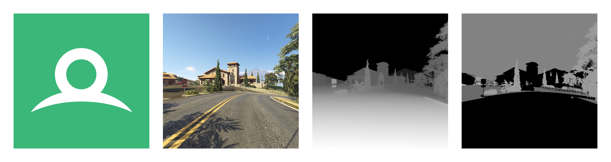
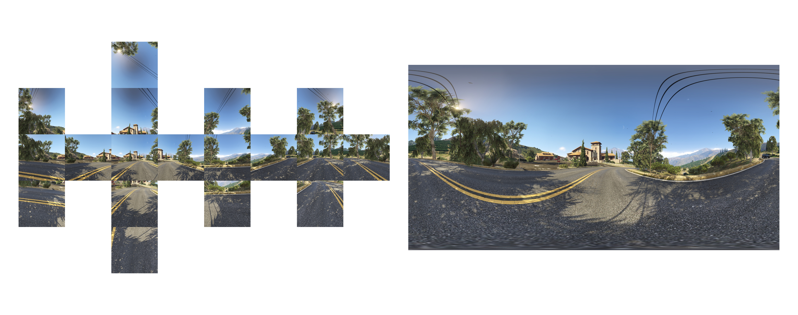
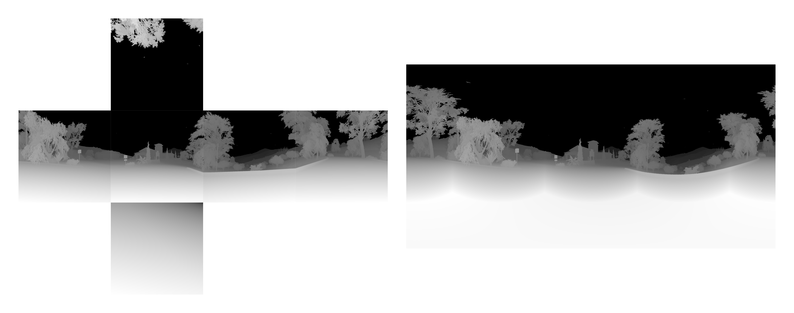
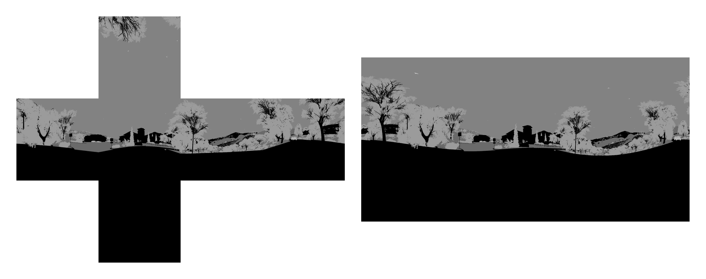
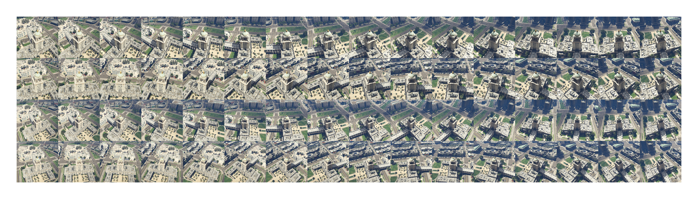
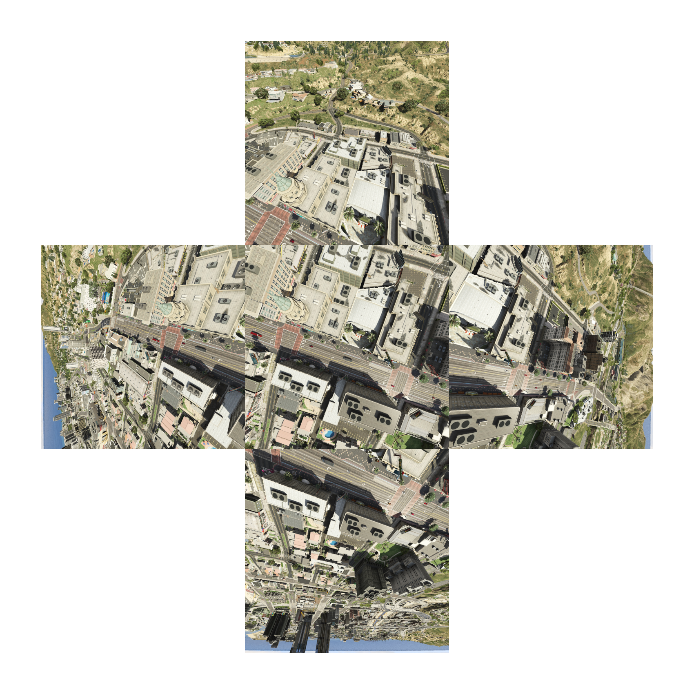
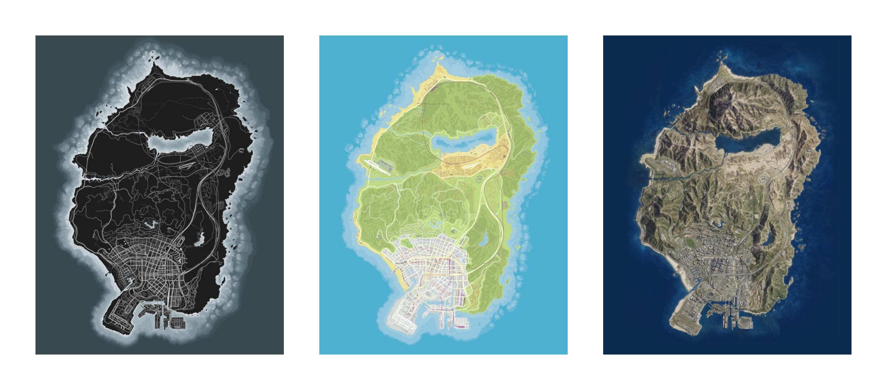
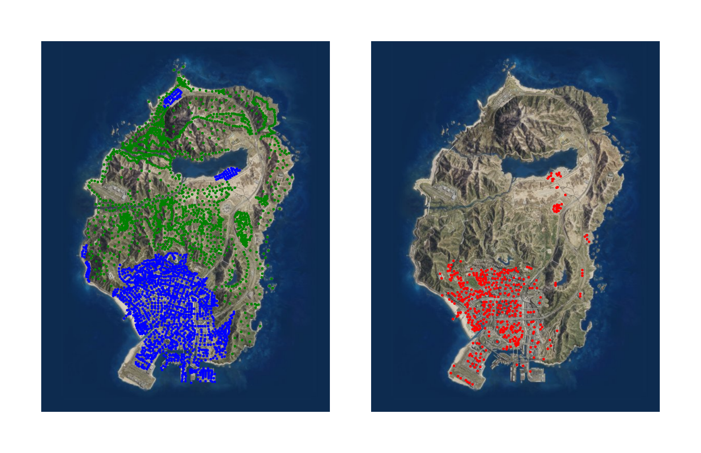
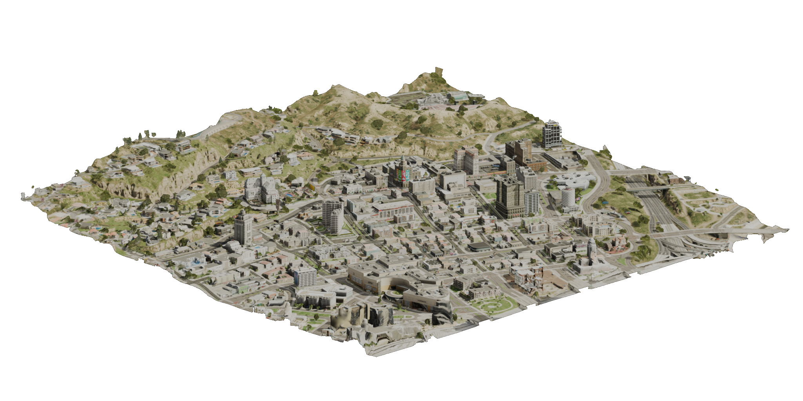

# Synthetic Data Generation for Visual Geo-Localization using GTA V

<p align="center">
  
</p>

<p align="center">
  <a href="https://creativecommons.org/licenses/by-nc-sa/4.0/"></a>
  
  
  
</p>

This repository contains the data generation pipeline to generate a visual geo-localization dataset from the video game Grand Theft Auto V (GTA V) proposed by *Skutsch et al.* in their papers **Synthetic Data Generation for Visual Geo-Localization using GTA V** and **No Mountain, no Building, no Cue? Synthetic Data Generation of Digital Surface Models and their Application to Visual Geo-Localization**. It can be used to generate ground-view images and panoramas, drone-view images, and (overlapping) aerial-view images, as well as their stencil map and depth map. For each image, the corresponding metadata is exported. This includes the intrinsic and extrinsic camera matrices, the camera's position and orientation within the game environment, the field-of-view (FOV), the prevailing weather conditions, and the current time of the day.

The setup for initializing the necessary software can be done either semi-automatically or completely manually. In the semi-automatic setup, most of the steps are performed by an initialization script, while in the manual setup, all steps are performed by the user.

The data generation has been tested on a Windows 10 system running `Grand Theft Auto V Legacy v1.0.3751.0`, `ScriptHookV v3751.0 / 1013.29`, `ScriptHookVDotNet v3.7.0-nightly.93`, `RenderDoc v1.42`, and `Windowed Borderless Gaming v2.1.0.1`. The 3D-reconstruction from aerial imagery has been tested on the same system running `RealityScan 2.2` and `Blender 4.5`. Steps may vary for other versions.


## Table of Contents

- [Features](#features)
- [Example Outputs](#example-outputs)
- [Important Notes](#important-notes)
- [Semi-Automatic Setup](#semi-automatic-setup)
  - [GTA V](#gta-v)
  - [Python](#python)
  - [Visual Studio](#visual-studio)
  - [Further Initialization](#further-initialization)
- [Manual Setup](#manual-setup)
  - [GTA V](#gta-v-1)
  - [Python](#python-1)
  - [Visual Studio](#visual-studio-1)
  - [ScriptHookV](#scripthookv)
  - [ScriptHookVDotNet](#scripthookvdotnet)
  - [Windowed Borderless Gaming](#windowed-borderless-gaming)
  - [RenderDoc](#renderdoc)
  - [Scripts](#scripts)
  - [Save Game](#save-game)
- [Data Generation](#data-generation)
  - [Selection of Locations](#selection-of-locations)
  - [Adjustment of the Config File](#adjustment-of-the-config-file)
  - [Data Generation](#data-generation-1)
- [In-Game Controls](#in-game-controls)
- [Possible Errors](#possible-errors)
- [3D-Reconstruction from Aerial Imagery](#3d-reconstruction-from-aerial-imagery)
  - [RealityScan](#realityscan)
  - [Blender](#blender)
- [Modification and Copyright Policy of Rockstar Games and Take-Two Interactive](#modification-and-copyright-policy-of-rockstar-games-and-take-two-interactive)
- [License](#license)
- [Citation](#citation)


## Features

- Ground-view images and full 360° ground-view panoramas.
- Drone-view images.
- Single and overlapping aerial-view images, the latter suited for photogrammetric 3D reconstruction.
- Depth map and stencil map export alongside every RGB image.
- Per-image metadata export: intrinsic and extrinsic camera matrices, camera position and orientation, FOV, weather conditions, and time of day.
- Three location-sampling modes: the current in-game location, a list of map-based locations, or random locations.
- All directories, downloads, and generation settings are configured centrally in a single `config.toml` file.
- An included browser-based tool (`map/map.html`) for selecting and editing render locations directly on the in-game map.
- An optional downstream pipeline for reconstructing a 3D surface model from the generated overlapping aerial-view images using RealityScan and Blender.


## Example Outputs

<p align="center">
  
</p>

*Ground-view and single-view images generated during data generation: RGB, depth, and stencil.*

<p align="center">
  
</p>

*The 18 cubemaps and the stitched panorama generated during ground-view panorama (RGB) data generation.*

<table>
<tr>
<td width="50%"></td>
<td width="50%"></td>
</tr>
</table>

*The 6 cubemaps and the stitched panorama generated during ground-view panorama data generation, for the depth map (left) and the stencil map (right).*

<p align="center">
  
</p>

*All 64 drone views generated during drone-view data generation.*

<p align="center">
  
</p>

*The 1 nadir and 4 oblique views generated during overlapping aerial-view data generation.*


## Important Notes

- The global hook feature of RenderDoc is used to inject into the GTA V process. This feature requires Secure Boot to be disabled.
- Currently, the pipeline only works with the Legacy version of Grand Theft Auto V.
- If any of the directories accessed require administrator privileges, the scripts must be executed as administrator.
- The initialization script's automatic downloads may only work on private networks.
- After copying the save game to the profile folder, you may need to manually select it after the next startup. To use the copied save game, check the box labeled `Select all local data`, click `Review`, and then click `Confirm`.
- It may take a few days for ScriptHookV to be updated after a GTA V update.
- The resolution set in the Windowed Borderless Gaming's `config.ini` file is multiplied by the global scaling factor defined in the Windows settings. For example, if the global scaling factor is set to 125%, the resolution is multiplied by 1.25.
- All directories, downloads, and generation settings are configured centrally in `config.toml`. Every script (`initialize_project.py`, `compile_script.py`, `generate_data.py`, `process_metadata.py`) reads its configuration from this file instead of taking command line arguments.
- Whenever `config.toml` is changed, the script must be re-compiled by running `compile_script.py`; this also copies the updated `config.toml` to the GTA V installation directory. Simply editing `config.toml` has no effect until this is done.
- After re-compiling, run `Reload()` in the ScriptHookVDotNet console (see [In-Game Controls](#in-game-controls)) to reload the updated script. The game does not need to be restarted.


## Semi-Automatic Setup

### GTA V
1. Download and install the latest version of GTA V Legacy from [Steam](https://store.steampowered.com/), [Epic Games](https://store.epicgames.com/), or the [Rockstar Games website](https://www.rockstargames.com/).
2. Open the Rockstar Games Launcher, then go to Settings.
3. In `Settings/Launcher Settings/General` disable the option `BattleEye`.
4. In `Settings/My Installed Games/Grand Theft Auto V` disable the option `Enable Automatic Updates`.
5. In `Settings/My Installed Games/Grand Theft Auto V` add `-windowed -width 1280 -height 720` to `Launch Arguments`.
6. Start the game, then go to the settings menu.
7. In `Settings/Notifications` disable all notifications.
8. In `Settings/Saving and Startup` set the option `Landing Page` to `Off` and set the option `Startup Flow` to `Load into Story Mode`.
9. Adjust the graphics settings to the desired level of detail and resolution. Make sure `NVIDIA TXAA` is enabled.
10. If you experience random frame drops in the menu or map at any point, enable V-Sync.
11. Close the game and edit the `settings.xml` file in the user directory of GTA V. Increase the `LodScale` to `1.5`, the `Shadow_Distance` to `5.0` and the `MaxLodScale` to `5.0`.

### Python
1. Download and install Python from the [website](https://www.python.org/downloads/). A version newer than 3.12 may cause deprecation warnings and errors.
2. Download and install the required modules by running `pip install -r requirements.txt`.

### Visual Studio
1. Download and install the latest version of Visual Studio from the [website](https://visualstudio.microsoft.com/).
2. Set it up for .NET and C++ Desktop development. `MSBuild`, `dumpbin`, and `lib` are located automatically and do not need to be added to the Windows `PATH`.

### Further Initialization
1. Open `config.toml` and fill in at least the `[Paths]` section, in particular:
   - `GTAV` Installation directory of GTA V (usually `C:\Program Files\Rockstar Games\Grand Theft Auto V Legacy`)
   - `GTAVUsr` User directory of GTA V (usually `C:\USER\Documents\Rockstar Games\GTA V`)
   - `VS` Installation directory of Visual Studio (usually `C:\Program Files\Microsoft Visual Studio\VERSION\Community`)

   Adjust the remaining paths and settings, such as the directories for the data, logs, configs, scripts, and WBG, as needed.
2. Download and install the modifications by running the initialization script `initialize_project.py`. The script takes no arguments; all paths are read from `config.toml`.


## Manual Setup

### GTA V
1. Download and install the latest version of GTA V Legacy from [Steam](https://store.steampowered.com/), [Epic Games](https://store.epicgames.com/), or the [Rockstar Games website](https://www.rockstargames.com/).
2. Open the Rockstar Games Launcher, then go to Settings.
3. In `Settings/Launcher Settings/General` disable the option `BattleEye`.
4. In `Settings/My Installed Games/Grand Theft Auto V` disable the option `Enable Automatic Updates`.
5. In `Settings/My Installed Games/Grand Theft Auto V` add `-windowed -width 1280 -height 720` to `Launch Arguments`.
6. Start the game, then go to the settings menu.
7. In `Settings/Notifications` disable all notifications.
8. In `Settings/Saving and Startup` set the option `Landing Page` to `Off` and set the option `Startup Flow` to `Load into Story Mode`.
9. Adjust the graphics settings to the desired level of detail and resolution. Make sure `NVIDIA TXAA` is enabled.
10. If you experience random frame drops in the menu or map at any point, enable V-Sync.
11. Close the game and edit the `settings.xml` file in the user directory of GTA V. Increase the `LodScale` to `1.5`, the `Shadow_Distance` to `5.0` and the `MaxLodScale` to `5.0`.

### Python
1. Download and install Python from the [website](https://www.python.org/downloads/). A version newer than 3.12 may cause deprecation warnings and errors.
2. Download and install the required modules by running `pip install -r requirements.txt`.

### Visual Studio
1. Download and install the latest version of Visual Studio from the [website](https://visualstudio.microsoft.com/).
2. Set it up for .NET and C++ Desktop development.
3. Add `dumpbin` and `lib` to the Windows `PATH`. In Microsoft Visual Studio 2026, the files are usually located at `C:\Program Files\Microsoft Visual Studio\18\Community\VC\Tools\MSVC\14.50.35717\bin\Hostx64\x64\`. Note that the versions in the path need to be adjusted accordingly. These tools are used directly from the command line in the [RenderDoc](#renderdoc) section below.

### ScriptHookV
1. Download the latest version of ScriptHookV from the [website](http://www.dev-c.com/gtav/scripthookv/).
2. Copy `ScriptHookV.dll` and `dinput8.dll` to the installation directory of GTA V.
3. If you want to use the `native trainer` plug-in, copy `NativeTrainer.asi` to the installation directory of GTA V.

### ScriptHookVDotNet
1. Download the latest version of ScriptHookVDotNet from the [website](https://github.com/scripthookvdotnet/scripthookvdotnet-nightly/releases).
2. Copy `ScriptHookVDotNet.asi`, `ScriptHookVDotNet.ini`, and `ScriptHookVDotNet3.dll` to the installation directory of GTA V.

### Windowed Borderless Gaming
1. Download the latest version of Windowed Borderless Gaming from the [website](https://westechsolutions.net/sites/WindowedBorderlessGaming/download).
2. Copy all the files into the folder `WBG`.
3. Copy the pre-configured `config.ini` from the `configs` folder into the folder `WBG`, overwriting the existing file.
4. In `config.ini`, set `DefaultDeskTopWidth`, `DefaultDeskTopHeight`, `Width`, and `Height` to the resolution the data should be generated at. This value must match the `Resolution` set in the `[Generation]` section of `config.toml`.

### RenderDoc
1. Download the latest stable version of the RenderDoc source code from the [GitHub repository](https://github.com/baldurk/renderdoc/releases/). The Python version, the build files are designed for, is referred to as XX in the following steps (e.g. 36 for Python v3.6).
2. Download the Python embeddable package for platform x86 and x64 for your Python version from the [Python website](https://www.python.org/downloads/). The current Python version is referred to as YY in the following steps (e.g. 312 for Python v3.12).
3. In the RenderDoc directory, replace `pythonXX` with `pythonYY` in each the following files: `qrenderdoc\pythonXX.natvis` and `qrenderdoc\qrenderdoc_local.vcxproj`.
4. In the RenderDoc directory, replace `pythonXX.lib` with `pythonYY.lib` in the following file: `qrenderdoc\qrenderdoc.pro`.
5. In the RenderDoc directory, replace `<PythonMajorMinor>\XX</PythonMajorMinor>` with `<PythonMajorMinor>\YY</PythonMajorMinor>` and `pythonXX` with `pythonYY` in the following file: `qrenderdoc\Code\pyrenderdoc\python.props`.
6. In the RenderDoc directory, rename the file `qrenderdoc\pythonXX.natvis` to `qrenderdoc\pythonYY.natvis`.
7. In the RenderDoc directory, delete all files in the directory `qrenderdoc\3rdparty\python\include`.
8. Copy all files from the include directory of your Python version (usually located at `C:\Program Files\PythonYY\include`) to `qrenderdoc\3rdparty\python\include`.
9. In the RenderDoc directory, delete all files in the directory `qrenderdoc\3rdparty\python\Win32`, all files in the directory `qrenderdoc\3rdparty\python\x64`, and the file `qrenderdoc\3rdparty\python\pythonXX.zip`.
10. From the Python embeddable package (x32) the files `pythonYY.dll` and `_ctypes.pyd` to `qrenderdoc\3rdparty\python\Win32` in the RenderDoc directory. From the Python embeddable package (x64), copy the file `pythonYY.zip` to `qrenderdoc\3rdparty\python\` and the files `pythonYY.dll` and `_ctypes.pyd` to `qrenderdoc\3rdparty\python\x64` in the RenderDoc directory.
11. In the directory `qrenderdoc\3rdparty\python\x64`, generate the `pythonYY.def` by running the following command: `dumpbin /exports pythonYY.dll`. In the directory `qrenderdoc\3rdparty\python\Win32`, generate the `pythonYY.def` by running the following command: `dumpbin /exports pythonYY.dll`. If the command could not be found, it has not been added to the PATH (see the section [Visual Studio](#visual-studio-1)).
12. In the directory `qrenderdoc\3rdparty\python\x64`, edit the `pythonYY.def`. Remove the header, the summary, and all numbers in front of the function names leaving only a list of names. Finally, add `EXPORTS` as new line above the function names and save the file. In the directory `qrenderdoc\3rdparty\python\Win32`, edit the `pythonYY.def`. Remove the header, the summary, and all numbers in front of the function names leaving only a list of names. Finally, add `EXPORTS` as new line above the function names and save the file.
13. In the directory `qrenderdoc\3rdparty\python\x64`, generate the `pythonYY.lib` by running the following command: `lib /def:pythonYY.def /machine:x64 /out:pythonYY.dll`. In the directory `qrenderdoc\3rdparty\python\Win32`, generate the `pythonYY.lib` by running the following command: `lib /def:pythonYY.def /machine:x86 /out:pythonYY.dll`. If the command could not be found, it has not been added to the PATH (see the section [Visual Studio](#visual-studio-1)).
14. Open the `renderdoc.sln` in Visual Studio. On start-up, retarget all projects to your current Platform Toolset version if possible.
15. In Visual Studio, open the configuration manager by right-clicking the solution and selecting `Configuration Manager...`. Set the active solution configuration to `Release` and the active solution platform to `x86`. Build the project by right-clicking the solution and selecting `Build Solution`. This may take a while.
16. Open the configuration manager by right-clicking the solution and selecting `Configuration Manager...`. Set the active solution configuration to `Release` and the active solution platform to `x64`. Build the project by right-clicking the solution and selecting `Build Solution`. This may take a while.
17. In the RenderDoc directory, the `x64` built files are located at `x64\Release`. Copy the `renderdoc.dll` to the scripts directory `scripts`.
18. Translate the generated header file to C# using the `HeaderTranslator` class from `initialize_project.py`, for example by running `python -c "from pathlib import Path; from initialize_project import HeaderTranslator; HeaderTranslator.c_to_cs(Path('INPUT'), Path('OUTPUT'))"` from the main directory. The input path must be the absolute path to `x64\Release\renderdoc_app.h` and the output path must be the absolute path to `scripts\RenderDocHeader.cs`.
19. Delete the directory `obj` and all `exp`, `lib`, and `pdb` files inside the `x64\Release` directory. Create the directory `RenderDoc` inside `C:\Program Files\`. Move all remaining files from `x64\Release` to this directory. Create the folder `x86` inside of the directory `RenderDoc`. Move all `dll`, `json`, `exe`, and `yes` files from `Win32\Release` to this directory.
20. The other downloaded and generated files may now be deleted.

### Scripts
1. Change to the directory `scripts`. The API version used in the original version of the file `RenderDoc.cs` is referred to as XX in the following steps (e.g. 1_5_0). The new API version is referred to as YY in the following steps (e.g. 1_6_0). 
2. Get the new API version from `RenderDocHeader.cs` by searching for the following line of code: `public unsafe struct RENDERDOC_API_YY`. Replace the API version in `RenderDoc.cs` in the following two lines of code: `public readonly RENDERDOC_API_XX API;` and `if (GetAPI(RENDERDOC_Version.eRENDERDOC_API_Version_XX, &api_pointer) != 1)`.
3. Fill in the `[Paths]` section of `config.toml`, in particular the `Data` path to which the data and logs are saved (usually `Data`).
4. Open the `DataGeneration.sln` in Visual Studio. On start-up, retarget all projects to your current Platform Toolset version if possible.
5. In Visual Studio, open the configuration manager by right-clicking the solution and selecting `Configuration Manager...`. Set the active solution configuration to `Release` and the active solution platform to `x64`.
6. In Visual Studio, build the project by right-clicking the solution and selecting `Build Solution`.
7. Create the folder `scripts` in the installation directory of GTA V.
8. In the directory `scripts`, the built files are located at `bin\x64\Release`. Copy `DataGeneration.dll` and its NuGet dependencies (`Microsoft.Bcl.AsyncInterfaces.dll`, `System.Buffers.dll`, `System.Collections.Immutable.dll`, `System.IO.Pipelines.dll`, `System.Memory.dll`, `System.Numerics.Vectors.dll`, `System.Runtime.CompilerServices.Unsafe.dll`, `System.Text.Encodings.Web.dll`, `System.Text.Json.dll`, `System.Threading.Tasks.Extensions.dll`, and `Tomlyn.dll`) to the folder `scripts` in the installation directory of GTA V.
9. Copy `config.toml` to the installation directory of GTA V. The script reads its configuration from `config.toml` in this directory at runtime, so this step must be repeated every time `config.toml` is changed.

### Save Game
1. Copy `SGTA50015` and `SGTA50015.bak` from the `configs` folder to the profile folder in the user directory of GTA V (usually `C:\USER\Documents\Rockstar Games\GTA V\Profiles\PROFILE\`), overwriting the existing files.


## Data Generation

### Selection of Locations
1. Open the tool for location selection located at `map\map.html` in a browser.
2. If a location file already exists, it can be imported by clicking the `Import CSV` button in the top left.
3. Select the setting for which the locations should be selected from the `Setting` dropdown in the top left. It can be set to `Urban`, `Rural`, or `Drone`. Select the map representation using the layer control in the top right. It can be set to `Game`, `Print`, or `Render`; the `Urban`, `Rural`, and `Drone` location layers can be shown or hidden independently there as well.

   <p align="center">
     
   </p>

   *The three map representations (`Game`, `Print`, and `Render`) that can be selected in `map.html`.*
4. Set the desired `Pitch`, `Roll`, `Yaw`, and `FOV` for new locations in the top left, then click on the map to add a location with these values. Click on an existing marker to select it; while selected, its `Setting`, `Pitch`, `Roll`, `Yaw`, and `FOV` can be edited in the panel and applied with the `Apply Changes` button, or the marker can be removed with the `Delete` button. Click on empty map space to deselect the current marker. All markers can be removed at once with the `Clear Markers` button.
5. Export the locations by clicking the `Export CSV` button in the top left and save it as `render_targets.csv` to the `map` folder.
6. Copy the render targets file to the `data` folder. An example file is included in the folder.

   <p align="center">
     
   </p>

   *The pre-selected render locations contained in the project's example `render_targets` file.*

### Adjustment of the Config File
1. Most generation settings (resolution, checkpoint interval, camera FOV, ground sampling distance, randomization, and so on) are set directly in `config.toml` and are picked up at runtime, without needing to re-compile the script.
2. The non-randomized default weather and time of day are still hardcoded in `Script\DataGenerator.cs`, in the parameterless `SetWeather()` and `SetTime()` methods of the `GameState` class. Adjust the default values there, namely:
   - `weather` in `SetWeather()`, with possible weather types being `CLEAR`, `EXTRASUNNY`, `CLOUDS`, `OVERCAST`, `RAIN`, `CLEARING`, `THUNDER`, `SMOG`, `FOGGY`, `XMAS`, `SNOW`, `SNOWLIGHT`, `BLIZZARD`, `HALLOWEEN`, `NEUTRAL`, `RAIN_HALLOWEEN`, and `SNOW_HALLOWEEN`.
   - `h`, `m`, and `s` in `SetTime()`, being the hour, minute, and second.

   Whether the random or the fixed value is used is controlled by `RandomWeather` and `RandomTime` in the `[Random]` section of `config.toml`.
3. Re-compile the script by running the script `compile_script.py`. The script takes no arguments; all paths are read from `config.toml`. This also copies the current `config.toml` to the GTA V installation directory, so **the script must be re-compiled after every change to `config.toml`**, even if `DataGenerator.cs` itself was not modified.
4. If GTA V is already running, run `Reload()` in the ScriptHookVDotNet console (see [In-Game Controls](#in-game-controls)) to reload the newly compiled script instead of restarting the game.

### Data Generation
1. Start the game with all necessary parameters by running the script `generate_data.py`. The script takes no arguments; the GTA V, data, and WBG directories are read from `config.toml`.
2. Once the game is loaded, start the data generation by pressing the [key](#in-game-controls) corresponding to the desired data generation mode. If a `current location` mode was selected, the data will only be generated for the current location. If a `map-based locations` mode was selected, the data will be generated for all locations in the `render_targets.csv` file for which `rendered` is set to `false`. If a `random locations` mode is selected, the data will be generated for `NumberOfRandomLocations` random locations, as set in the `[Random]` section of `config.toml`.


## In-Game Controls

| Key       | Function                                                                                          |
| --------- | --------------------------------------------------------------------------------------------------|
| F4        | Toggle the native trainer console                                                                 |
| F5        | Open the script console                                                                           |
| F6        | Toggle the First-Person-View (FPV) and the visibility of the HUD elements                         |
| F7        | Toggle the visual modifier (removes all vehicles and pedestrians and disables fog)                |
| F8        | Toggle the freezing of the scene                                                                  |
| F9        | Toggle the No-Clip mode                                                                            |
| F10       | Destroy all cameras and reset the render script cameras                                           |
| F12       | Manually trigger the RenderDoc capture                                                            |
| PageUp    | Increase the speed while in No-Clip mode                                                          |
| PageDown  | Decrease the speed while in No-Clip mode                                                          |
| Num1      | Data Generation: current location    - ground-view panorama and corresponding aerial-view image   |
| Num2      | Data Generation: map-based locations - ground-view panoramas and corresponding aerial-view images |
| Num3      | Data Generation: random locations    - ground-view panoramas and corresponding aerial-view images |
| Num4      | Data Generation: current location    - drone-view images and corresponding aerial-view image      |
| Num5      | Data Generation: map-based locations - drone-view images and corresponding aerial-view images     |
| Num6      | Data Generation: map-based locations - overlapping aerial-view images                             |
| Num7      | Data Generation: current location    - ground-view image and corresponding aerial-view image      |
| Num8      | Data Generation: map-based locations - ground-view images and corresponding aerial-view images    |
| Num9      | Data Generation: random locations    - ground-view images and corresponding aerial-view images    |

In the script console (F5), the command `Reload()` reloads the compiled script without restarting the game; this is needed after every re-compile (see [Adjustment of the Config File](#adjustment-of-the-config-file)).


## Possible Errors

| Error Message                                                              | Description                                              |
| -------------------------------------------------------------------------- | -------------------------------------------------------- |
| `Unrecoverable fault - Please restart the game`                            | The `GTA5.exe` has been used instead of the launcher     |
| `[Errno 10054] An existing connection was forcibly closed...`              | The header is incorrect or the firewall blocks access    |
| `FATAL: Unknown game version, check http://dev-c.vom for updates`          | New ScriptHookV version required                         |
| `[Errno 13] Permission denied: ...`                                        | Administrator privileges required                        |
| `Cloud Sync Conflict`                                                      | Select the correct save game                             |
| `ERR_GFX_D3D_INIT`                                                         | Re-install GTA, update drivers/BIOS, disable OC          |
| `The website "..." could not be requested.`                                | No internet connection or URL changed                    |
| `The file "..." could not be requested.`                                   | Website has changed, switch to manual setup for this mod |
| `The website "..." does not contain any links.`                            | Website has changed, switch to manual setup for this mod |
| `The RDC file "..." could not be opened.`                                  | Saving the capture file took too long                    |
| `FileNotFoundError: [WinError 2] The system can't find the specified file` | Check the PATH for `dumpbin` and `lib`                    |
| `An error occurred during the compilation of the ... source code.`         | Add ScriptHookVDotNet as reference[^1]                   |
| `RuntimeError: The path "..." does not exist.`                             | Check the paths configured in `config.toml`              |
| Crash without error message during the data generation                     | The GPU may have run out of memory                       |

[^1]: The `DataGeneration.csproj` already references `ScriptHookVDotNet3.dll` at its default installation path. If the path differs, open `ProjectName/References/Add Reference...` via the Solution Explorer, remove the existing reference, and browse for `ScriptHookVDotNet3.dll` in the installation directory of GTA V. Also ensure `System.Drawing` and `System.Windows.Forms` are added to the references.


## 3D-Reconstruction from Aerial Imagery

<p align="center">
  
</p>

*A 3D surface model reconstructed from overlapping aerial-view images.*

### RealityScan

1. Create the trajectory file by running the script `process_metadata.py`. The script takes no arguments; it reads `metadata.csv` from the `Data` path configured in `config.toml` and writes `trajectory.csv` next to it.
2. Open RealityScan.
3. At `Workflow > Application > Settings > Coordinate System` set the project and output coordinate system to `local`.
4. At `Workflow > [1] Inputs > Images` add all overlapping aerial-view images of one area.
5. At `Workflow > Import & Metadata > Trajectory` import the flight log data file and set `File format` to `Image X/Lon Y/Lat Z/Alt Yaw Pitch Roll`, `Euler angles order (YPR)` to `ZYX (photogrammetric YPR convention)`, `Camera mount` to `Nadir-facing, X-axis to right wing (RealityScan convention)`, `Values separator` to `Semicolon ";"`, `Ignore first line` to `Yes`, `Coordinate system` to `local:1 - Euclidean`, `Automatically group camera calibration` to `All in one group as a fixed lens was used`, and `Accuracy settings source` to `Global camera prior settings`.
6. At `Workflow > [2] Process > Align Images` start the image alignment.
7. Adjust the bounding box for the reconstruction.
8. At `Workflow > [2] Process > Calculate Model` under `Settings` set `Image depth map calculation / Normal model / Image downscale` to `1`, `Mesh calculation / Remove marginal triangles` to `Enable`, and `Mesh calculation / Minimal distance between two vertices` to `0.001`.
9. At `Workflow > [2] Process > Calculate Model > Normal quality` start the calculation of the surface model.
10. At `Workflow > [2] Process > Simplify` simplify the mesh if necessary.
11. At `Workflow > [2] Process > Clean Model` remove topology defects from the model if necessary.
12. At `Workflow > [2] Process > Texture & Colorize > Calculate Texture` start the texturing of the surface model.
13. At `Workflow > [3] Output > Export` export the textured surface model as `.obj` file, set `Export vertex normals` and `Export vertex colors` to `Yes`, and under `Export transformation settings`, set `Coordinate system` to `Project output` and `Transformation preset` to `Default`.


### Blender

1. Start Blender and create a new blender file.
2. At `File/Import/Wavefront (.obj)` import the surface model.
3. In the `Object Properties` of the surface model remove all translations and rotations.
4. By clicking `Shift + A` add a new camera to the scene.
5. In the `Object Data Properties` of the camera set the `Lens Unit` to `Field of View`, the `Field of View` to the value the ground-view images have been rendered with (`GroundDroneFOV` in `config.toml`, usually `50°`), and the `Clip End` to `10000 m`.
6. In `Output Properties/Format` set the `Resolution X` and `Resolution Y` to the the desired resolution (`Resolution` in `config.toml`, usually `1024`).
7. In `View Layer Properties/Passes/Light` enable the `Diffuse Color Pass`.
8. A Python script can be used to control camera parameters, such as position and rotation, as well as trigger rendering. The rendered images can then be used for visual geo-localization algorithms.


## Modification and Copyright Policy of Rockstar Games and Take-Two Interactive

Rockstar Games has issued two statements regarding its policies on the [use of single-player mods](https://support.rockstargames.com/articles/5NVOAYjcTomO8v6SX2k76k/pc-single-player-mods) and the [publication of copyrighted Rockstar Games material](https://support.rockstargames.com/articles/7bNaeoMFTV0iUDGhStTXvz/policy-on-posting-copyrighted-rockstar-games-material).

Rockstar Games states that it will not take legal action against third-party projects that involve GTA V, as long as the modifications do not:
- provide multiplayer or online services;
- include tools, files, libraries, or functions that could be used to affect multiplayer or online services;
- use or import Rockstar's or other intellectual property;
- include making new games, stories, missions, or maps.

Rockstar Games also states that Take-Two Interactive does not object to the use of materials for non-commercial purposes, as long as the materials do not include:
- pre-release footage of any kind;
- spoilers such as the ending of the game or an edited combination of cutscenes, dialogues, or major story events;
- in-game entertainment such as the TV shows or comedy performances;
- actions that encourage cheating by describing, displaying, or promoting ways to cheat online;
- modifications that violate Rockstar's rights;
- content that violates the [Terms of Service](https://www.rockstargames.com/legal).

Since the modifications do not affect the online mode, do not use Rockstar's or anyone else's intellectual property beyond the approved use, do not involve the creation of new game content and the data generated does not contain story content, does not encourage cheating, and does not violate Rockstar's rights, this project is in compliance with Rockstar Games' and Take-Two Interactive's Modification and Copyright Policies. It should be noted, however, that these policies are not a license and Take-Two reserves the right to object to any third-party project, or to revise, revoke, and/or withdraw these statements at any time in its sole discretion.


## License

The GTAGeo data generation pipeline (this repository) and the GTAGeo dataset by Skutsch et al. are licensed under the [Creative Commons Attribution-NonCommercial-ShareAlike 4.0 International (CC BY-NC-SA 4.0)](https://creativecommons.org/licenses/by-nc-sa/4.0/) license. See the [LICENSE](LICENSE) file for the full license text.

This license governs the pipeline and dataset themselves and is granted in addition to, and does not override or supersede, the [Modification and Copyright Policy of Rockstar Games and Take-Two Interactive](#modification-and-copyright-policy-of-rockstar-games-and-take-two-interactive) described above, which continues to apply to any use of Grand Theft Auto V and its assets.


## Citation

Please cite our work if you use data from the GTAGeo dataset, generate new data using our pipeline, or modify our pipeline.

**Synthetic Data Generation for Visual Geo-Localization using GTA V**, presented at the 11th International Congress on Information and Communication Technology (ICICT 2026):

```bibtex
@inproceedings{skutsch_gtageo_2026,
	author = {Skutsch, Nicolai and Hellwich, Olaf and Fuchs-Kittowski, Frank},
	title = {Synthetic {Data} {Generation} for {Visual} {Geo}-{Localization} using {GTA} {V}},
	booktitle = {Proceedings of 11th {International} {Congress} on {Information} and {Communication} {Technology} ({ICICT} 2026)},
	volume = {2},
	publisher = {Springer},
	year = {2026}
}
```

**No Mountain, no Building, no Cue? Synthetic Data Generation of Digital Surface Models and their Application to Visual Geo-Localization**, presented at the 21st International Conference on Computer Vision Theory and Applications (VISAPP 2026):

```bibtex
@inproceedings{skutsch_gtadsm_2026,
	author = {Skutsch, Nicolai and Hellwich, Olaf and Fuchs-Kittowski, Frank},
	title = {No {Mountain}, no {Building}, no {Cue}? {Synthetic} {Data} {Generation} of {Digital} {Surface} {Models} and {Their} {Application} to {Visual} {Geo}-{Localization}},
	booktitle = {Proceedings of the 21st {International} {Conference} on {Computer} {Vision} {Theory} and {Applications} ({VISAPP} 2026)},
	volume = {2},
	pages = {743--751},
	isbn = {978-989-758-804-4},
	doi = {10.5220/0014487400004084},
	publisher = {SciTePress},
	year = {2026}
}
```